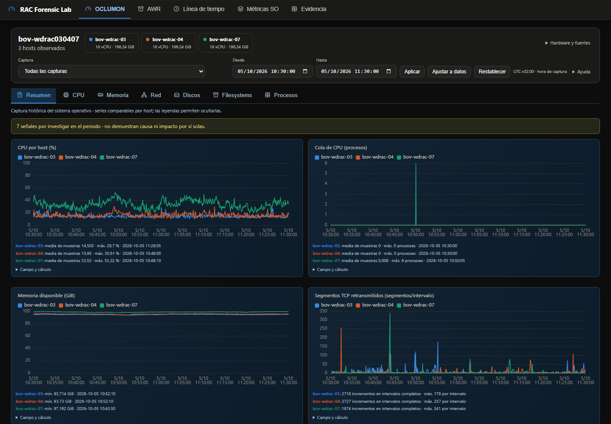

# OCLUMON: navegación por recursos

La cabecera compartida identifica el caso una sola vez, adapta las tarjetas al número de hosts y mantiene los filtros con calendario y zona de captura. Hardware, procedencia, cobertura y secciones no implementadas quedan en un desplegable. Los colores anteriores se conservan; el cuarto host usa el siguiente color de la paleta, junto con nombres y estilos de línea.

Resumen muestra CPU, cola, memoria disponible (o memoria física libre cuando memavl no existe) y retransmisiones TCP. CPU, Memoria, Red, Discos, Filesystems y Procesos permiten profundizar sin perder el intervalo. No se añadieron comparación de periodos ni botones decorativos. AWR y SAR mantienen sus módulos y gráficos.

Las observaciones se recalculan desde eventos discretos dentro del intervalo aplicado. Presentan el máximo, hora, host y entidad; el diálogo muestra regla, fuente y línea/bloque de origen y permite abrir el original o el recurso. Las señales se distinguen de una interpretación causal. El umbral SQL TCP de 50 incrementos queda como revisión y sus episodios aparecen en la cronología. Los contadores del host no se atribuyen a una NIC.

En Red, ens193 conserva «Sin clasificación». Las tasas de indiscarded/outdiscarded se expresan en paquetes/s y no se suman como cantidades. Rol y MTU provienen de la fuente; MTU 9000 no prueba conectividad jumbo extremo a extremo. Se ofrecen interfaces individuales en vez de sumar capas de red. Los campos SYSTEM cpusys, cpuuser, cpuiowait, cpusteal y #procs_blocked alimentan el modelo común cuando existen; iowait no se presenta como utilización del disco.

Discos dispone de inventario ordenable y búsqueda, selección de dispositivo y gráficos de wait, cola, IOPS y throughput. El inventario muestra máximo, hora y P95 de las medias por intervalo. El extremo observado de 764.641.210 ms se mantiene sin clipping. Filesystems prioriza una tabla de capacidad con barras y última muestra del periodo, y conserva evolución bajo demanda. Procesos distingue máximos individuales entre los PIDs listados de una misma denominación de consumo agregado.

## Comprobaciones

- Tres CSV originales: 721 muestras por host; 05/10/2026 10:30–11:30 UTC+02:00; CPU inicial 12,59 %, 15,37 % y 37,05 %. Procedencia 19c declarada por el usuario, independiente de la versión de la base de datos.
- Caso legacy original completo de DEPT300, incluido el TXT indicado por el usuario: hora sin zona inventada, memoria libre diferenciada y extremo de I/O conservado. Procedencia 11.2.0.4 declarada; la versión de base de datos solo deriva de evidencia independiente AWR.
- Chromium: CSV, legacy y fixtures sintéticas exclusivas de tests con 1, 2 y 4 hosts, cada uno en Madrid, Los Ángeles y Tokio. Navegación, filtro vigente, captura, intervalo vacío, cursor compartido, un único tooltip, scroll libre, colores y móvil sin desbordamiento. Validación adicional de ens193, búsqueda y selección desde el inventario de discos.
- npm ci, npm test y npm run build; 24 tests Python (22 correctos y 2 pruebas reales opcionales omitidas porque los casos completos se validaron por separado); smoke correcto, compileall y diff --check. Smoke conserva los 11 episodios anteriores y comprueba los 4 nuevos TCP positivos y de revisión.
- Los recuentos y hashes SQL de telemetría, dimensiones y AWR coinciden con los perfiles anteriores de CSV y legacy. Los archivos originales y HTML de referencia no se modificaron.

## Rendimiento

Tres pares alternados en el mismo Chromium y máquina, con los mismos CSV, viewport 1440×1000 y zona Madrid. Son mediciones locales, no un benchmark universal. [Muestras completas](rendimiento-render.json).

| Mediana | Anterior | Recursos |
| --- | ---: | ---: |
| Carga inicial | 1.951 ms | 1.239 ms |
| Aplicar filtro | 261 ms | 144 ms |
| Heap JS inicial | 44,43 MB | 31,65 MB |
| Altura de cabecera | 277 px | 131 px |
| Canvas iniciales | 10 | 4 |

La ingesta completa CSV se midió en el mismo entorno: 101,02 s antes y 98,98 s con los campos adicionales; no se interpreta esa pequeña diferencia como una mejora significativa del parser. La generación HTML del perfil fue 4,09 s y 2,18 s respectivamente. La versión anterior pesaba 12,39 MB; el informe final pesa aproximadamente 13,60 MB y añade telemetría de CPU y evidencias. Se conserva la carga diferida y no se recrean gráficos al filtrar. Las estadísticas usan resolución original; se reutiliza su cálculo para la misma métrica, host e intervalo. La metadata NIC se guarda por tramos y cambios, sin repetir etiquetas en cada muestra ni extenderlas a través de huecos.

## Límites explícitos

util y svctm se conservan en los registros originales y diagnósticos; no se les asigna una interpretación universal de saturación ni se grafican con un contrato no validado. Su incorporación requiere confirmar la definición específica del recolector; las cabeceras y unidades por sí solas no justifican equipararlos a otros campos. NFS, ADVM, PROCESS AGGREGATE y ASMINST_DB siguen reconocidos y no implementados. Las observaciones se limitan a las reglas y fuentes disponibles; no prueban causa raíz ni salud global. El estado persistido pasa a versión 5: las bases antiguas necesitan una ingesta completa para incorporar estos campos y reglas; no se sirve un análisis antiguo como si estuviera actualizado.

## Referencias

[Oracle: métricas legacy](https://docs.oracle.com/cd/E11882_01/rac.112/e41959/troubleshoot.htm) y [CSV por secciones y tasas NIC](https://docs.oracle.com/en/database/oracle/oracle-database/12.2/atnms/oclumon-dumpnodeview.html) definen significado y unidades. [USE](https://www.brendangregg.com/usemethod.html) organiza utilización, saturación y errores según campos presentes. [NIST](https://www.itl.nist.gov/div898/handbook/eda/section3/eda35h.htm) distingue una observación atípica de demostrar un error. [CHM en OEM, referencia histórica](https://dbamarco.wordpress.com/2016/03/07/cluster-health-monitor/) inspira la exploración por recurso; no constituye un contrato de parsing.

## Capturas del resultado

[CPU](cpu.png) · [Memoria](memoria.png) · [Red y ens193 sin clasificación](red.png) · [Discos](discos.png) · [Filesystems](filesystems.png) · [Procesos](procesos.png) · [Móvil](mobile.png) · [Cuatro hosts sintéticos](cuatro-hosts.png) · [Legacy](legacy.png).
