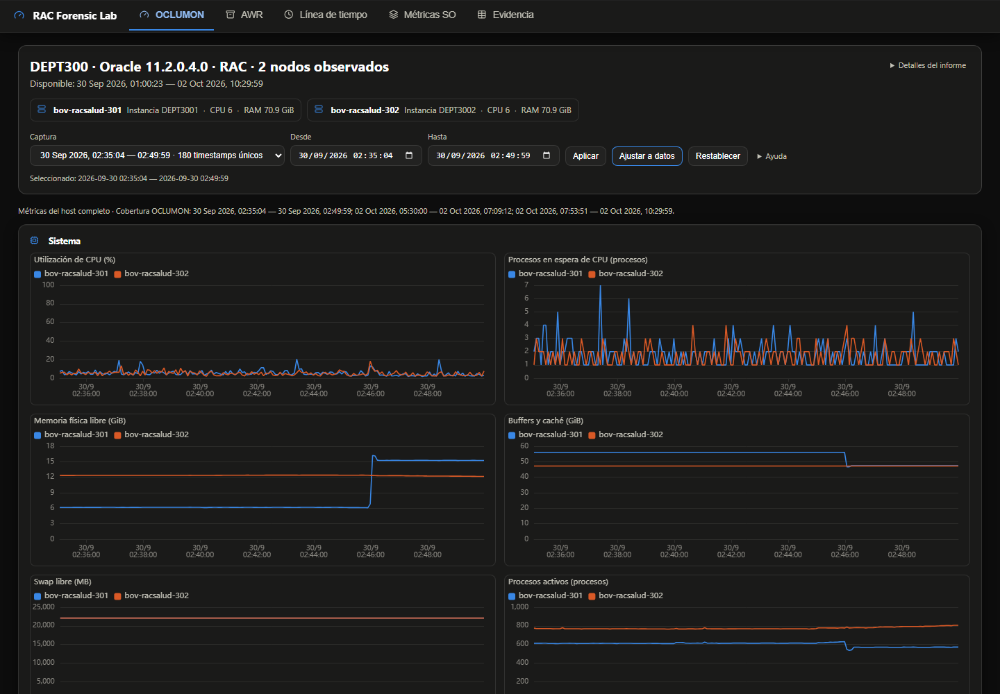
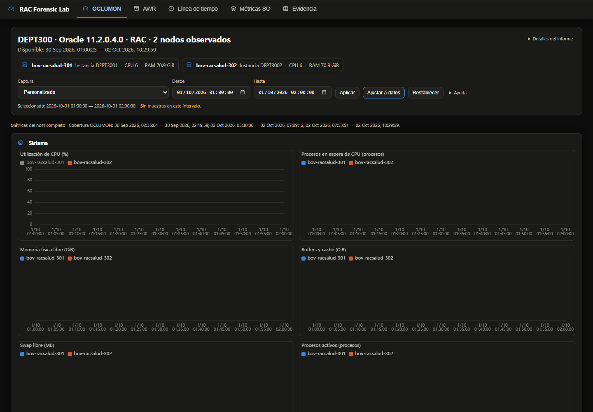

# Cabecera universal, filtro temporal y rendimiento

Base: master `7921038dad7242d13b09e41459db8512b239f5cd`, PR #3 ya fusionado. Rama: `codex/cabecera-temporal-perfilado`. Se comprobó git status y fetch; no había cambios locales versionados. Los artefactos locales previos se conservaron. Evidencias originales leídas sin modificar.

## Resultado funcional

Cabecera compartida entre pestañas con identidad, hosts, cobertura disponible, rango seleccionado y ayuda discreta. Hosts OCL/SAR separados de la política AWR; RAC requiere evidencia explícita. Las leyendas y colores siguen controlando visibilidad por gráfico.

Existe un rango aplicado separado de las fechas pendientes. Captura aplica inmediatamente; Todo y Restablecer recuperan el dominio completo; fechas manuales muestran Personalizado. Ajustar busca muestras solamente dentro del intervalo solicitado. Sin datos no amplía el rango; un punto usa un margen visual de ±1 s. Las horas originales se codifican con UTC como soporte neutral, sin conversión por zona del navegador.

Los CHM se parsean una sola vez y se reutilizan para telemetría y episodios. El estado persistido incluye contexto SQL, episodios y series, con versión y firma de los hechos SQL. `--solo-reporte` rechaza estados antiguos, incompletos o modificados. No ejecuta ingesta, no borra tablas y no relee CHM. No se implementó ingesta incremental.

El HTML offline comparte relojes y constantes, preservando cada valor, null y marca `<`. Decodifica únicamente gráficos montados, consulta getOption una vez al registrar y evita reaplicar un rango idéntico. Se retiró el dataZoom interno: incluso con gestos desactivados capturaba la rueda. El control temporal permanece en la cabecera y la página desplaza libremente.

## Mediciones del caso real

Windows, Python 3.13.15, DuckDB 1.5.6, PyArrow 25.0.1; Chromium headless. Las rutas reales y hashes están en los JSON adjuntos y en Detalles del informe. Los perfiles corresponden al árbol local antes del commit, identificado además por hash de código. El último ajuste de scroll solo modifica el bundle; se regeneró el HTML mediante solo-reporte.

| Medida | Base (dos ejecuciones) | Versión final |
|---|---:|---:|
| Proceso completo, reloj | 109,65 / 129,09 s | 83,54 s |
| Ingesta | 30,32 / 53,91 s | 38,92 s |
| Episodios, incluyendo persistencia nueva | 69,71 / 61,93 s | 38,00 s |
| Persistencia (incluida en fila anterior) | — | 8,03 s |
| Render HTML | 9,54 / 13,04 s | 5,76 s |
| Pico RSS | 1,254 / 1,262 GB | 1,142 GB |
| HTML | 59.115.003 bytes | aproximadamente 16.068.800 bytes (−72,8 %) |

La variabilidad local es considerable: no se atribuye todo el cambio a SQL ni se declara resuelto el rendimiento general. El parseo y cálculo de episodios siguen dominando; no se ajustaron umbrales ni se redujo precisión para ganar velocidad. La lectura instrumentada incluye decodificación del texto y efectos del buffer/OS, no es tiempo de disco puro. Clasificación, preparación de storage, conversión, ejecución SQL, commit y rendimiento por archivo figuran separados en final-case.json. Solo-reporte mide carga/validación persistida más render; verifica SHA256 idéntico del archivo DuckDB antes/después.

## Elección de carga SQL

54 ejecuciones aisladas: tres métodos × tres lotes × índices mantenidos/diferidos × tres repeticiones, sobre 45.290 filas reales. Cada resultado se comparó como multiconjunto completo, incluyendo tipos/nulls; el total incluye conversión, SQL, commit y reconstrucción de índices. RSS es el incremento muestreado dentro del proceso, no memoria absoluta. Las importaciones de dependencias se precargan en este benchmark; la ruta de producción mide por separado su coste frío.

| Método | Lote | Índices mantenidos: mediana / RSS Δ | Índices diferidos: mediana / RSS Δ |
|---|---:|---:|---:|
| unnest | 1000 | 1.869 s / 13.9 MB | 1.417 s / 12.4 MB |
| unnest | 5000 | 1.115 s / 13.5 MB | 0.910 s / 12.9 MB |
| unnest | 20000 | 1.103 s / 28.5 MB | 1.001 s / 28.3 MB |
| arrow | 1000 | 0.380 s / 16.6 MB | 0.490 s / 13.1 MB |
| arrow | 5000 | 0.392 s / 14.0 MB | 0.157 s / 12.9 MB |
| arrow | 20000 | 0.237 s / 14.6 MB | 0.207 s / 12.1 MB |
| dataframe | 1000 | 0.822 s / 12.9 MB | 1.118 s / 11.5 MB |
| dataframe | 5000 | 0.517 s / 14.1 MB | 0.551 s / 11.4 MB |
| dataframe | 20000 | 0.387 s / 14.0 MB | 0.374 s / 11.4 MB |

Se eligió Arrow con lotes de 20.000 e índices mantenidos: 0,237 s frente a 1,103 s de UNNEST, con aproximadamente la mitad de RSS adicional. Diferir índices no justifica ampliar el cambio por su diferencia pequeña. Una transacción por archivo mantiene rollback completo. Tipos especiales que requieren la coerción previa de DuckDB conservan UNNEST; ausencia de Arrow también tiene fallback.

## Integridad y pruebas

Equivalencia exacta: 45.290 telemetrías, 5 snapshots AWR, 50 waits, 5 filas de cada dimensión; 868 series, 2.791.869 puntos incluyendo 1.712 marcadores null, 19.410 marcas `<` y 170 episodios. Hashes SQL, valores, máximos, rankings y dispositivos coinciden. Dos AWR HTML no soportados permanecen clasificados unknown, sin inventar análisis.

Las pruebas de navegador verifican captura 30/09 02:35:04–02:49:59, rango amplio 01:00–03:30 y ajuste exacto, capturas del 02/10, Todo, vacío, punto único, cambio de pestaña, carga diferida con entradas pendientes, preservación de leyendas y scroll sobre canvas. Se ejecutan en Madrid, Los Ángeles y Tokio, con cero solicitudes externas y sin errores JavaScript. Capturas y métricas adjuntas.

Comandos reproducibles desde la raíz (activar un Python con requirements instalados):

```powershell
python Analizer/tests/smoke_test.py Analizer/tests
python Analizer/tests/test_contracts.py
python -m compileall -q Analizer
git diff --check
cd Analizer/dashboard-ui
npm ci
npm test
npm run build
```

Herramientas de medición opcionales requieren psutil, pyarrow, pandas y playwright con Chromium instalado:

```powershell
python Analizer/tests/profile_case.py RUTA_CASO .work-pr4/caso
python Analizer/tests/benchmark_storage.py --help
python Analizer/tests/browser_temporal_test.py .work-pr4/caso/informe_incidente.html .work-pr4/browser
python Analizer/analizador.py RUTA_CASO --db .work-pr4/caso/case.duckdb --solo-reporte --salida .work-pr4/reporte.html
```

El informe real y DuckDB se conservan en `.work-pr4/release-arrow/`, excluidos de Git para evitar publicar evidencias completas. Este documento versiona las mediciones y las capturas de validación.

## Navegador final y regeneración

Medianas entre las tres zonas horarias; cada carga es un contexto nuevo. Arranque incluye load, primer canvas y 200 ms de asentamiento; tiempos de filtro incluyen automatización. No son percentiles de producción.

| Medida | Base | Final |
|---|---:|---:|
| Arranque (ms) | 6875.8 | 1966.2 |
| Heap inicial (MB) | 382.5 | 56.0 |
| Heap tras scroll (MB) | 508.4 | 155.3 |
| Aplicar filtro (ms) | 611.6 | 197.6 |

Solo-reporte: 4,789 s en la primera ejecución y 16,827 s tras reconstruir el bundle, 16,068,638 bytes, 170 episodios y archivo DuckDB sin cambios. Las tareas largas y tiempos por frame se conservan en browser-metrics.json; tras montar muchos gráficos el heap crece y no se afirma scroll sin pausas.





## Comprobaciones de entrega

Pasaron 19 comprobaciones smoke, 4 pruebas de contratos (parse único, reporte persistido, rollback y compatibilidad), casos límite temporales de npm test, compileall y git diff --check. npm ci y npm run build regeneraron dashboard.bundle.js desde fuentes. La validación del caso real compara todos los valores, no solo contadores. No se creó otro PR ni se fusionó esta rama con master.
