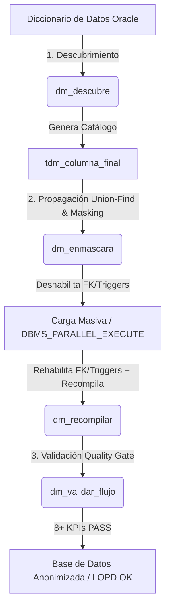

# Motor Enmascaramiento Oracle

Motor nativo PL/SQL de alto rendimiento para bases de datos **Oracle Enterprise Database**, diseñado y construido a partir de la ingeniería de funcionamiento interno del paquete **Oracle Enterprise Manager (OEM) / Oracle Cloud Control Data Masking and Subsetting Pack**.

---

## 🎯 Origen y Fundamento Técnico (Basado en OEM Cloud Control)

En las arquitecturas empresariales, **Oracle Cloud Control (OEM)** ejecuta el proceso de Data Masking mediante la generación e inyección automatizada de scripts dinámicos de control y grafos de dependencias:

* `dsg_exec_pkg.sql`: Paquete motor de ejecución de transformaciones.
* `graph_tables.sql` & `graph_data.sql`: Mapeo del grafo de relaciones y jerarquías entre tablas.
* `inline_mask.sql` & `mask_exec.sql`: Ejecución de algoritmos de transformación por lotes e inline.
* `subset_pre_script.sql` & `subset_post_script.sql`: Desactivación y reactivación de restricciones, disparadores e índices.
* `t_exec_params.lst` & `tdm_import.sql`: Parámetros de control e importación de reglas del catálogo.

El **Motor Enmascaramiento Oracle** replica y optimiza este mismo flujo operativo en un entorno **autónomo y nativo PL/SQL** (desplegado sobre el esquema administrador `ASTSYSADMIN`). Ofrece una solución de **coste cero en licencias** (sin requerir *Oracle Advanced Security Option* ni licencias OEM por Core), ejecutable de forma transparente mediante `SQL*Plus`, tareas programadas o pipelines de CI/CD.

---

## 🧬 Evolución Arquitectónica: Los 3 Modelos del Motor

Para lograr un motor técnicamente defendible, eficiente, seguro y capaz de propagar integridad referencial en bases de datos gigabyte/terabyte, la arquitectura evolucionó a través de **3 modelos bien definidos**:

```
 [ Modelo 1: Sin Biyección ]  ──►  [ Modelo 2: Biyección Afín ]  ──►  [ Modelo 3: Biyección Feistel (FPE) ]
   (Hash Determinista OEM)          (Aritmética Modular 1:1)           (Red Feistel 4-Rondas + HMAC)
   - Colisiona en UNIQUE            - Cero colisiones                  - Cero colisiones
   - Requiere exclusiones           - Reversible por Known-Plaintext   - Irreversible (Criptográficamente seguro)
```

---

### 1️⃣ Modelo 1: Versión Sin Biyección (`version_sin_biyeccion`)
* **Mecanismo:** Inspirado en el enfoque estándar de hash con sal (*pepper*) de Cloud Control (`DBMS_UTILITY.GET_HASH_VALUE` / SHA-1 + `PEPPER_MASK`).
* **Ventajas:** Implementación simple, determinista e irreversible de forma individual.
* **Limitación Técnica:** Incurre en el **Principio del Cajón de Palomas (*Pigeonhole Principle*)**. Al reducir la entropía de salida sobre dominios finitos, genera **colisiones de datos en columnas con restricciones `UNIQUE`**, lo que obligaba a realizar exclusiones manuales o fallos en cargas masivas.

---

### 2️⃣ Modelo 2: Versión Biyección - Modelo Afín (`version_biyeccion/Modelo_Afin`)
* **Mecanismo:** Introduce la **Transformación Afín Modular Biunívoca**:
  $$f(x) = (a \cdot x + c) \pmod m$$
  donde el multiplicador $a$ se fuerza a ser impar y no divisible por 5 ($\gcd(a, 10^k) = 1$).
* **Ventajas:** **Cero colisiones garantizadas** (mapeo biyectivo 1:1) en restricciones `UNIQUE` y velocidad de ejecución ultra-rápida en CPU nativa.
* **Limitación Técnica:** Es una función lineal. Con solo **dos pares de datos conocidos** $(x_1, y_1)$ y $(x_2, y_2)$ (*Known-Plaintext Attack*), un atacante puede despejar $a$ y $c$ mediante aritmética modular y **descifrar todo el dominio** (pseudonimización reversible).

---

### 3️⃣ Modelo 3: Versión Biyección - Modelo Feistel / FPE (`version_biyeccion/Modelo_Feistel`) ⭐ *RECOMENDADO*
* **Mecanismo:** Implementa **Cifrado Preservador de Formato (Format-Preserving Encryption - FPE)** utilizando una **Red de Feistel Balanceada de 4 Rondas** combinada con *Cycle-Walking* y una Pseudo-Random Function (PRF) impulsada por `DBMS_CRYPTO.MAC` (`HMAC-SHA1`).
* **Ventajas Definitivas:**
  1. **Cero Colisiones:** Permutación biyectiva estricta por construcción matemática.
  2. **Irreversibilidad Criptográfica:** Resistente a ataques de texto claro conocido (*Known-Plaintext*); imposible de descifrar sin el Pepper secreto.
  3. **Independencia de Coprimalidad:** Funciona de manera transparente sobre cualquier módulo $m$ (sin importar si es potencia de 10).
  4. **Cumplimiento RGPD / LOPD Defendible:** Proporciona **anonimización real** lista para auditoría y exportación a entornos de terceros.

---

## 📊 Equivalencia Técnica frente a OEM Cloud Control

Este motor proporciona una equivalencia funcional y técnica completa con **Oracle Enterprise Manager Cloud Control Data Masking and Subsetting Pack**:

| Capacidad Técnica | OEM Cloud Control Data Masking | Motor Enmascaramiento Oracle (Nativo) |
|---|---|---|
| **Descubrimiento de PII** | Escaneo mediante reglas de catálogo OEM | Algoritmo Regex + Score Semántico por Diccionario (`dm_descubre`) |
| **Propagación Referencial** | Grafo de dependencias (`graph_tables.sql`) | **Algoritmo Union-Find (Disjoint-Set)** + Prioridad PK/FK |
| **Preservación de Estructura** | Módulos de formato OEM | Cálculo de control DNI/NIE/CIF y Checksum IBAN Módulo 97 |
| **Gestión de Restricciones** | `subset_pre_script` / `subset_post_script` | Desactivación y Reactivación con preservación del estado `ENABLED` |
| **Sanado de Esquema** | Compilación manual tras fallas | **Autocompilación Iterativa + Filtro de Errores Ambientales (`ORA-00942`)** |
| **Procesamiento Masivo** | Cargas por Agent | `DBMS_PARALLEL_EXECUTE` por Chunks de ROWID |
| **Control de Calidad (Quality Gate)** | Reporte gráfico de la consola | **Puerta de Calidad Automatizada con 8+ KPIs (`dm_validar_flujo`)** |
| **Licenciamiento** | Coste elevado por Socket/Core | **Nativo PL/SQL - 100% Coste Cero** |

---

## 🛠️ Arquitectura de Fases Operativas



### 1. Descubrimiento Automático e Incremental (`dm_descubre`)
Escanea el diccionario de datos (`dba_tab_columns`, `dba_col_comments`), identifica patrones sensibles (DNI, NIF, Teléfono, IBAN, Nombres, Direcciones) y genera el catálogo de reglas `tdm_columna_final`. Reevalúa solo tablas modificadas (`incremental`).

### 2. Propagación Referencial y Enmascaramiento (`dm_enmascara`)
Aplica el algoritmo **Union-Find** para agrupar claves primarias y foráneas relacionadas. Genera mapas de dominio estables (`tdm_mask_key_map`) para garantizar que **el valor padre y el valor hijo se enmascaren con exactamente el mismo dato**, manteniendo la integridad referencial sin generar huérfanos.

### 3. Puerta de Calidad / Quality Gate (`dm_validar_flujo`)
Audita el resultado ejecutando controles automatizados de calidad:
* **KPI-01:** Objetos válidos (autocuración y filtro de errores de entorno `ORA-00942`).
* **KPI-02:** Restauración exitosa de restricciones y triggers.
* **KPI-03:** Ausencia de errores en logs de ejecución.
* **KPI-04 & KPI-05:** Validación matemática de dígitos de control (DNI/CIF) e IBAN Módulo 97.
* **KPI-06:** Ausencia de colisiones en columnas `UNIQUE`.
* **KPI-07:** Control de concurrencia de ejecuciones.
* **KPI-08:** Integridad referencial (cero registros huérfanos PK/FK).

---

## 📂 Estructura del Repositorio

```text
Datamasking/
├── README.md
├── version_sin_biyeccion/            # Modelo 1: Hash Determinista (OEM Standalone)
└── version_biyeccion/                # Modelos Biyectivos 1:1
    ├── Modelo_Afin/                  # Modelo 2: Transformación Afín Modular (Fast CPU)
    └── Modelo_Feistel/               # Modelo 3: Red Feistel / FPE con DBMS_CRYPTO (Recomendado)
```

---

## 🚀 Guía de Instalación y Uso Rápido (Modelo Feistel Recomendado)

### 1. Instalación (Conectado como `SYS` o DBA)
```sql
-- Ejecutar el instalador desde la carpeta Modelo_Feistel:
@version_biyeccion/Modelo_Feistel/99_install_datamasking.sql
```

### 2. Descubrimiento de Esquema
```sql
@version_biyeccion/Modelo_Feistel/dm_descubre MI_ESQUEMA_APP
```

### 3. Ejecución del Enmascaramiento
```sql
-- Ejecuta el enmascaramiento con el ID de ejecución generado:
@version_biyeccion/Modelo_Feistel/dm_enmascara 1 Y
```

### 4. Validación de la Puerta de Calidad (Quality Gate)
```sql
@version_biyeccion/Modelo_Feistel/dm_validar_flujo MI_ESQUEMA_APP 1
```

### 5. Recompilación de Apoyo (Opcional)
```sql
@version_biyeccion/Modelo_Feistel/dm_recompilar MI_ESQUEMA_APP
```
